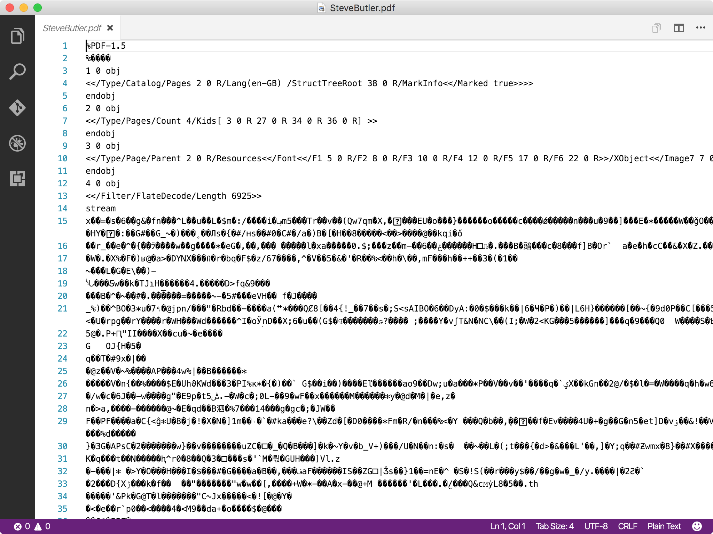

- title : power of plain text
- theme : simple 
- transition : default

***

# The power of plain text

***

## What isn't plain text?

- .doc, .xls, .ppt, .pdf files 
- images & video
- binary data format

***

***

## What are plain text files?

- anything that you can open in a plain text editor and understand its content
- no presentation power, just rows of text

***

## Why plain text?

- usefor taking notes, todo lists, draft emails/blogs
- text editors are very quick to open

---

### Portable 

' can be consumed on all platforms and edited by huge array of non-proprietarty tools

---

### Insurance against obselence

' longevity - data can outlive any application needed to read or edit it, suitable for archiving
' the data becomes meaningless without the context the application provides for it.

---

### Searching & Diffing

- makes it very easy to [compare changes](https://github.com/mediaingenuity/Loans.WebApp/commit/ea6b6a2e8e2a8a094acd1f70595b91ccf2265174)

***

## What can you do with it?

- plain text formats have different strengths

---

### csv

    first, last, age, gender, postal
    Cameron, Wood, 38, Female, V0T 6G2
    Edna, Conner, 42, Male, X9X 6H3
    Frederick, Manning, 31, Male, V2V 6X2

---

### json

    [lang=json]
    {
        first: "Cameron",
        last: "Wood",
        Age: "38",
        likes: ["camping", "golf"]
    }
    
---

### xml

    [lang=xml]
    <?xml version="1.0" encoding="UTF-8"?>
    <root>
        <row>
            <first>Cameron</first>
            <last>Wood</last>
            <age>38</age>
            <likes>
                <like>camping</like>
                <like>golf</like> 
            </likes>
        </row>
    </root>

---

### html

    [lang=html]
    <html>
        <body>
            <h1>Plain text is great</h1>
            
I can be read by anthing

            <ul>
                <li>Portable</li>
                <li>Longevity</li>
                <li>Focus on the text</li>
            </ul>
        </body>
    </html>

[example](https://github.com/mediaingenuity/Loans.Api/blob/master/README.md)

---

### md

    # Plain text is great
    
    I can be read by anything

    - Portable
    - Longevity
    - Focus on the text

[example](https://github.com/mediaingenuity/Loans.Api/blob/master/README.md)

---

[example](https://github.com/mediaingenuity/Loans.Api/blob/master/README.md)

---

